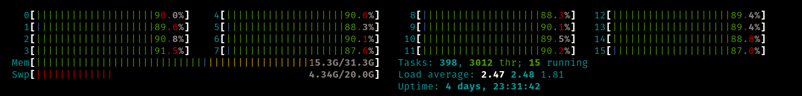
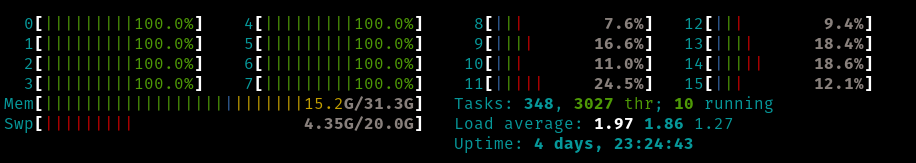
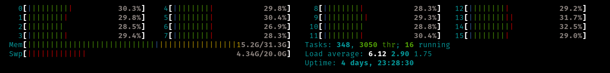

# Docker build

We've seen how to use `docker run` to run pre-existing images. But what if we want to build our own? 

We can use `docker build` to build an image from a `Dockerfile`. A `Dockerfile` is essentially a list of commands that need to be run to install everything we want into our image and set up how things will work within the container.

Here is a glossary of Dockerfile commands:

* `FROM image_name:version`: What’s the base image we want to build on top of
* `RUN cmd`: How to run "cmd" during the build process
* `ADD <src> <dest>`: copy the src file on host to the `dest` location inside image
    * (`<src>` can be a URL, compressed files will be decompressed)
* `COPY <src> <dest>`: copy the src file on host to the `dest` location inside image
* `CMD ["cmd", "arg1", ... "argn"]`: specifies the default run command (`cmd arg1 ... argn`)
* `ENTRYPOINT ["cmd", "arg1"]`: specifies the command ran before at start up before user commands
* `ENV MY_VAR=VALUE`: defines environmental variable
* `SHELL bash`: specifies the default shell
* `USER username`: change user
* `EXPOSE port`: expose a port to the outside world
* `ARG MY_ARG=VALUE`: Build time argument.


## Breaking down a Dockerfile example

Let's take a look at a Dockerfile that will compile the code [calculate_pi.cpp](./calculate_pi.cpp):
```Dockerfile
FROM ubuntu:latest

# Install dependencies gcc
RUN apt-get update 
RUN apt-get install -y g++
RUN rm -rf /var/lib/apt/lists/*

ENV NUM_STEPS=100000

# add in the files
COPY ./calculate_pi.cpp /build/calculate_pi.cpp

# compile the code
RUN g++ /build/calculate_pi.cpp -o /build/calculate_pi.o -fopenmp

CMD ["bash", "-c", "/build/calculate_pi.o ${NUM_STEPS}"]
```

### `FROM`

The `RUN` command specifies the base image used in this build. In the above case, we're using the `ubuntu:latest` image as our base image. This means that we'll be building upon the previously built image. 

### `RUN`

The `RUN` command specifies a command to run during the build stage. In this example we've run:
```dockerfile
RUN apt-get update 
RUN apt-get install -y g++
RUN rm -rf /var/lib/apt/lists/*
...
RUN g++ /build/calculate_pi.cpp -o /build/calculate_pi.o -fopenmp
```
The first 3 commands run `apt-get` to install packages in Ubuntu and `rm` to remove some bloat files. 
The last command runs `g++` to compile our code.

### `ENV`

We can use `ENV` to specify the environmental variable that will be used within the container. 
In this case we're setting `NUM_STEPS` to have the default value of `100000`. We can overwrite this when running using `-e NUM_STEPS=X`.

### `COPY`

We can use `COPY` to copy files from the host system into the container. In this case we copy our source code `./calculate_pi.cpp` into the container and to the location `/build/calculate_pi.cpp`

### `CMD`

We use `CMD` to set or overwrite the default run command. In this case we're running:
```dockerfile
CMD ["bash", "-c", "/build/calculate_pi.o ${NUM_STEPS}"]
```

This will be result in:
```bash
bash-c "/build/calculate_pi.o ${NUM_STEPS}"
```

## Building our image

Now that we have our `Dockerfile` setup, let's build it using `docker build`:
```bash
docker build -t obriens/calculate_pi:latest .
```

Let's break this down:
* `-t`: Here we're assigning the "tag" ` obriens/calculate_pi:latest` to the iamge. This will be the image name. Note if we omit the version (in this case `latest`) then the version will default to `latest`.
* `.`: Here we're giving the path to the build location (where the files are). We can give a full or relative path. Since we're in the same directory we can use `.` which is "here".

Notice that we've omitted a file name. By default, `docker build` looks for a file called `Dockerfile`. As we will see, this can be overwritten.

## Layers and Caching

As we build, we notice that the build is performed on layers:
```
[+] Building 17.2s (11/11) FINISHED                              docker:default
 => [internal] load build definition from Dockerfile                       0.0s
 => => transferring dockerfile: 403B                                       0.0s
 => [internal] load metadata for docker.io/library/ubuntu:latest           0.0s
 => [internal] load .dockerignore                                          0.0s
 => => transferring context: 2B                                            0.0s
 => CACHED [1/6] FROM docker.io/library/ubuntu:latest                      0.0s
 => [internal] load build context                                          0.0s
 => => transferring context: 38B                                           0.0s
 => [2/6] RUN apt-get update                                               4.3s
 => [3/6] RUN apt-get install -y  gcc g++                                 11.7s
 => [4/6] RUN rm -rf /var/lib/apt/lists/*                                  0.1s 
 => [5/6] COPY ./calculate_pi.cpp /build/calculate_pi.cpp                  0.0s 
 => [6/6] RUN g++ /build/calculate_pi.cpp -o /build/calculate_pi.o -fopen  0.5s 
 => exporting to image                                                     0.5s 
 => => exporting layers                                                    0.5s 
 => => writing image sha256:160a4e827e2104de2ab42a781110a05175ec4f5bcc98e  0.0s 
 => => naming to docker.io/obriens/calculate_pi:latest                     0.0s
```

Let's modify `calculate_pi.cpp` and rerun the code:
```
[+] Building 0.6s (11/11) FINISHED                               docker:default
 => [internal] load build definition from Dockerfile                       0.0s
 => => transferring dockerfile: 403B                                       0.0s
 => [internal] load metadata for docker.io/library/ubuntu:latest           0.0s
 => [internal] load .dockerignore                                          0.0s
 => => transferring context: 2B                                            0.0s
 => [1/6] FROM docker.io/library/ubuntu:latest                             0.0s
 => [internal] load build context                                          0.0s
 => => transferring context: 1.31kB                                        0.0s
 => CACHED [2/6] RUN apt-get update                                        0.0s
 => CACHED [3/6] RUN apt-get install -y  gcc g++                           0.0s
 => CACHED [4/6] RUN rm -rf /var/lib/apt/lists/*                           0.0s
 => [5/6] COPY ./calculate_pi.cpp /build/calculate_pi.cpp                  0.0s
 => [6/6] RUN g++ /build/calculate_pi.cpp -o /build/calculate_pi.o -fopen  0.5s
 => exporting to image                                                     0.0s
 => => exporting layers                                                    0.0s
 => => writing image sha256:015addfc091276262c4d712f2927c71d89d20e311872e  0.0s
 => => naming to docker.io/obriens/calculate_pi:latest          
```
We can see that layers that haven't changed aren't reran. Instead, we used the "cached" version of these layers. However, we still need to rerun any layer after. This is something to keep in mind. If you have files that you'd like to change regularly, it's best to put them as late in the build process as possible.

Since we're building upon previous layers, the number of layers we use can have an impact on the final size of the image. Consider `Dockerfile-layers` example:
```dockerfile
FROM ubuntu:latest

# Install dependencies gcc
RUN apt-get update && apt-get install -y  \
    g++ && \
    rm -rf /var/lib/apt/lists/*

ENV NUM_STEPS=100000

# add in the files
COPY ./calculate_pi.cpp /build/calculate_pi.cpp

# compile the code
RUN g++ /build/calculate_pi.cpp -o /build/calculate_pi.o -fopenmp

CMD ["bash", "-c", "/build/calculate_pi.o ${NUM_STEPS}"]
```

In the above we've combined the dependency installs into a single line, and as a result, a single stage. We can build this example and assign it to a new tag:
```bash
docker build -t obriens/calculate_pi:layers -f Dockerfile-layers .
```
Notice that we're using `-f filename` to specify the name of the Dockerfile we're building from.

Let's look at the size of this image using `docker image ls`:
```
> docker image ls obriens/calculate_pi 
REPOSITORY             TAG       IMAGE ID       CREATED          SIZE
obriens/calculate_pi   layers    6c5f6486554b   13 seconds ago   360MB
obriens/calculate_pi   latest    015addfc0912   3 minutes ago    402MB
```

By combining these three steps together we've saved 40MB of space. This might not sound like much but small consistent efforts can save a lot of money in storage costs.

## Multistage builds

Let's say we have some dependency that is only needed for one part of the build, but not needed for the final product. This could be a compiler, a git repo or source code. Keeping these in the final image could add unnecessary bloat to the image. To avoid this we can use multi-stage builds. Let's take a look at the `Dockerfile-multi` file:
```dockerfile
FROM ubuntu:latest AS base

# Install dependencies gcc
RUN apt-get update && apt-get install -y \
    g++\
    && rm -rf /var/lib/apt/lists/*

# add in the files
COPY ./calculate_pi.cpp /build/calculate_pi.cpp

# compile the code
RUN g++ /build/calculate_pi.cpp -o /build/calculate_pi.o -fopenmp


FROM ubuntu:latest AS final
COPY --from=base /build/calculate_pi.o /app/calculate_pi.o
COPY --from=base /lib/x86_64-linux-gnu/libgomp.so.1 /lib/x86_64-linux-gnu/libgomp.so.1
ENV NUM_STEPS=100000

CMD ["bash", "-c", "/app/calculate_pi.o ${NUM_STEPS}"]
```

Here we're using two stages in our build. On the first line we specify that we're using the `ubuntu:latest` image, but we're calling this stage `base` using:
```dockerfile
FROM ubuntu:latest AS base
```

This is our first layer. We could have called this anything, `base` isn't a keyword.
In this stage we install `g++`, copy the source code `calculate_pi.cpp` into the container and then compile it using `g++`. As soon we've compiled `calculate_pi.o`, we no longer need `g++`.

It makes sense to make a new stage that just has the compiled code and what is needed to run it. Since we're using Open MP (`-fopenmp`), we'll also need that library. So we create a new stage to our build called `final`:
```dockerfile
FROM ubuntu:latest AS final
```

We're again using the Ubuntu image. Next we copy over what we need from the previous image:
```dockerfile
COPY --from=base /build/calculate_pi.o /app/calculate_pi.o
COPY --from=base /lib/x86_64-linux-gnu/libgomp.so.1 /lib/x86_64-linux-gnu/libgomp.so.1
```
Here we're using `--from=STAGENAME` to specify the stage that we're copying from. We copy across the compiled `calculate_pi.o`, but also the library `/lib/x86_64-linux-gnu/libgomp.so.1` (Open MP is installed while installing `g++`).

We can build this with:
```bash
docker build -t obriens/calculate_pi:multi -f Dockerfile-multi .
```

Let's look at the sizes of all our `calculate_pi` images:
```bash
docker image ls obriens/calculate_pi
```

```
docker image ls obriens/calculate_pi

REPOSITORY             TAG           IMAGE ID       CREATED          SIZE
obriens/calculate_pi   multi         3f2b4f88f155   2 minutes ago    78.5MB
obriens/calculate_pi   latest        98a4b6284ff2   8 minutes ago    402MB
obriens/calculate_pi   layers        9451ff72301e   8 minutes ago    360MB
```

Using multi-stage builds we can dramatically reduce the size of our final images.


# Resource Management with Docker:

We can limit the resources available to a container. This can be useful if we don't want a single container to use up all our host system's resources, or if we want to run multiple containers on a single system.

## CPU management

We can manage the CPU usage with the following arguments:
* `--cpuset-cpus`: This allows us to list the CPUs available to this container
* `--cpus`: This allows us to specify how many CPUs can be used by a container

Let's take a closer look at these. We can use the `nproc` command :
```
docker run --rm -it  obriens/calculate_pi:multi bash -c "nproc"
```
One my machine, this returns `16`, which is the number of CPU cores I have on my machine.

We can limit our container to only run on CPUs 0,1, and 2 using `--cpuset-cpus=0-2`, for example:
```
 docker run --rm -it --cpuset-cpus=0-2 obriens/calculate_pi:multi bash -c "nproc"
```
Now gives `3`. Let's say we wanted this process to run on only cpus with id 1,4,6 and 11:
```
 docker run --rm -it --cpuset-cpus=1,4,6,11 obriens/calculate_pi:multi bash -c "nproc"
```
This now reads `4`, as expected.

Let's make sure this is the case. Let's run our calculate_pi example with `NUM_STEPS=500000000` (a number larger enough to take some time):
```
docker run --rm -it -e NUM_STEPS=500000000 obriens/calculate_pi:multi 
```

```
Running: 500000000 Across number of threads: 16
Calculation of Pi: 3.14159
Duration: 0.123085 seconds
```

We see that all 16 CPUs are involved in the calculation:



Let's repeat this, but instead we'll just use the first 8 CPUs (0-7):
```
docker run --rm -it -e NUM_STEPS=500000000 --cpuset-cpus=0-7 obriens/calculate_pi:multi
```

OpenMP now only sees 8 threads available:
```
Running: 500000000 Across number of threads: 8
Calculation of Pi: 3.14159
Duration: 0.176029 seconds
```
And only CPUs 0-7 are running at high capacity:


We can also use `--cpus` to limit CPU usage. The usage is a little awkward as it defines the number of CPUs per second that are available for usage. So `1.5` will use 1.5 CPUs every second. Let's run our example with 4 CPUs/s:
```
docker run --rm -it -e NUM_STEPS=500000000 --cpus=4  obriens/calculate_pi:multi
```

Notice that Open MP still sees 16 CPUs:
```
Running: 500000000 Across number of threads: 16
Calculation of Pi: 3.14159
Duration: 0.401084 seconds
```
However, each CPU is only operating at ~30%:


If we only have access to 4 CPUs/second, then each CPU will be running our code for 4/16 of the time which gives 25% usage. The remaining ~5% is background tasks.

In summary:
* `--cpuset-cpus` allows us to explicitly list the CPUs that we want to run on.
* `--cpus` specifies the **maximum number of CPUs/per second** that our container can use.

## Memory management

We can restrict the memory usage of a container using `-m` or `--memory`. This commands takes a positive integer followed by `b`, `k`, `m` or `g` to specify the unit. For example:
```bash
 docker run --rm -it -m 100m  obriens/calculate_pi:multi
```
Would limit the memory usage of the container to 100 Mb. 
```bash
 docker run --rm -it --memory=1g  obriens/calculate_pi:multi
```
Would limit the memory usage of the container to 1 Gb. 

Depending on how the program in our container works, this could lead to out or memory errors or cause the program to slow down as memory needs to be freed before new allocations can be made.