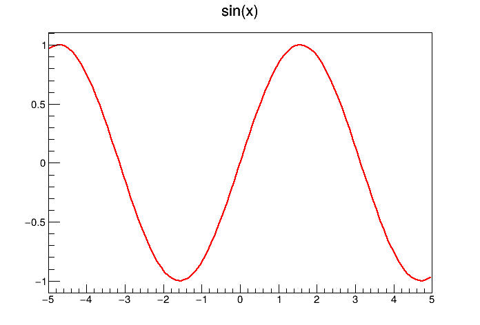

# Docker Run

In this example we'll be working through how to run containers using docker. For this example we can use `docker pull` to "pull" a docker image from [dockerhub](https://hub.docker.com/). We'll use the following images:
* [Cern's ROOT package](https://hub.docker.com/r/rootproject/root)
* [Ubuntu](https://hub.docker.com/_/ubuntu)
* [Python](https://hub.docker.com/_/python)

## Pulling images with `docker pull`

There are tons of pre-build docker images available. [Docker Hub](https://hub.docker.com/) is one of the most popular **container registry** and is the one that we'll use for this workshop. Others include:
* [Github Container Registry](https://docs.github.com/en/packages/working-with-a-github-packages-registry/working-with-the-container-registry)
* [GitLab Container Registry](https://docs.gitlab.com/ee/user/packages/container_registry/)
* [Amazon Elastic Container Registry (ECR) ](https://aws.amazon.com/ecr/)
* [Azure Container Registry (ACR)](https://azure.microsoft.com/en-us/products/container-registry/)

As you might be able to tell from Amazon and Azure, these are designed to be used along with their respective web services. In high performance computing, clusters will often have this own container registries, for example [NERSC](https://docs.nersc.gov/development/containers/registry/).

By default, docker will search [Docker Hub](https://hub.docker.com/) for the images we're searching for. To "pull" an image from a registry to our own machine we can use:
```bash
docker pull user_name/container_name:version
```

For example we can pull the `latest` version of `rootproject`'s `root` container using:
```bash
docker pull rootproject/root:latest
```

Note the name of different versions in docker speek is `tags`. In the above case `latest` is a `tag`. 

There are some images that are verified as "official images". These are often associated with some specific organization, for example the Ubuntu. For these official images, there is no `user_name` associated with the image, we therefor omit the `user_name/` section of the pull command. For example, to get the `latest` version of `ubuntu` we could run:
```bash
docker pull ubuntu:latest
```

If the `version` is omitted, the value defaults to `latest`. For example, if we wanted to get the latest version of the `python` image:
```bash
docker pull python
```
You might notice the line:
```
Using default tag: latest
```
Which indicates that we're using the latest version by default.

## Running images with `docker run`:

A container can be run from an image using the `docker run` command. When running a container, we must specify which image we're using. For example to run the [hello-world](https://hub.docker.com/_/hello-world) example:
```bash
docker run hello-world
```
If we haven't already pulled the image, docker will search a remote registry for the image we're trying to run. For example you might of seen:
```
Unable to find image 'hello-world:latest' locally
latest: Pulling from library/hello-world
c1ec31eb5944: Pull complete 
Digest: sha256:305243c734571da2d100c8c8b3c3167a098cab6049c9a5b066b6021a60fcb966
Status: Downloaded newer image for hello-world:latest
```

If we run the `hello-world` example we will see the challange:
```
To try something more ambitious, you can run an Ubuntu container with:
 $ docker run -it ubuntu bash
```

So why don't we:
```bash
docker run -it ubuntu bash
```
Which will result in a prompt like:
```bash
root@085b38b7d51e:/# 
```
We are now inside a container. Let's run a few commands:
```bash
ps
```
will give an output like
```
    PID TTY          TIME CMD
      1 pts/0    00:00:00 bash
      9 pts/0    00:00:00 ps
```
The `ps` command is used to show the processes that are running on a system. Interestingly from within the container we only see two processes `bash` and `ps`, whereas on our host machine we likely have 100s-1000s of processes running. This brings us to our first important observation: **We don't have full access to the host system from within the container.**

Let's take a step back and look at the docker command we ran:
```bash
docker run -it ubuntu bash
```
We've passed the flags `-it` or `-i`, `-t`:
* `-i`: this keeps the STDIN open
* `-t`: this enables TTY

The above is just fancy speak for having an **i**nteractive terminal that we can write to and that will **t**alk back to use. Or in fancy speak, having a terminal that can process standard input (STDIN) and return standard output (STDOUT). 


## Default run commands

You might have noticed that in the hello-world example, we didn't provide a command after the image name `hello-world`. Whereas in the `ubuntu` example we provided a command `bash`. By default, docker images may have a default run command (`CMD`). We can overwrite this run command by providing a new command. For example let's look at the `python` image:
```bash
docker run -it python
```
Which starts a python interior. What happens when we use `bash` instead to get start a bash shell?
```bash
docker run -it python
```

Or if we run `python --version`
```bash
docker run -it python python --version
```

What happens if we specify an older version of python:
```bash
docker run -it python:2.7-slim python --version
```
It's common for python images to provide a `slim` tag, these typically only have python installed in a small base image, such as [Alpine OS](https://alpinelinux.org/) (and on [Docker Hub](https://hub.docker.com/_/alpine)), with only the standard library included.

## Stopping a container

So far we've used containers that stop when a command finishes. Let's create a container that will run forever:
```bash
docker run -it ubuntu bash -c "while true; do echo 'Hello, Docker!'; sleep 10; done"
```

This image will print "Hello, Docker!" every 10 seconds. We can cancel this with `ctrl` + `c`. Let's "detach" this container from from our current terminal using the `-d` flag:
```bash
docker run -it -d ubuntu bash -c "while true; do echo 'Hello, Docker!'; sleep 10; done"
```
We will get a random string like:
```
201623cd8157e01e72f871c2c1b66b5dc94326751b96f3df30fdc17f2429379f
```
This is the container's ID. We can check using:
```bash
docker ps
```
Which will give something like:
```
CONTAINER ID   IMAGE      COMMAND                  CREATED          STATUS          PORTS                                         NAMES
201623cd8157   ubuntu     "bash -c 'while true…"   41 seconds ago   Up 41 seconds                                                 blissful_robinson
```
We can read the output from this container using `docker logs` and passing either the container id, or the `NAME` of the container:
```bash
docker logs blissful_robinson
```
Let's stop this container using `docker stop`:
```bash
docker stop blissful_robinson
```
As with before we can stop by passing either the container id or the name of the container.

Docker stop works by first send a `SIGTERM` signal to the container. `SIGTERM` is a soft request for a process to stop. This gives the process a chance to gracefully exit (which might involve closing files to prevent file corruption!). After 10 seconds (by default) docker will send the container a `SIGKILL` signal, forcing a hard stop.

## Restarting Containers

Let's start the infinite container again, except this time we'll assign the container a name using the `-n` or `--name` flag:
```bash
docker run -it -d --name infinity ubuntu bash -c "while true; do echo 'Hello, Docker!'; sleep 10; done"
```
With `docker ps` we can now see that the container has been assigned the name `inifity`:
```
CONTAINER ID   IMAGE      COMMAND                  CREATED         STATUS         PORTS                                         NAMES
b9f05196ec25   ubuntu     "bash -c 'while true…"   2 seconds ago   Up 2 seconds                                                 infinity
```

Let's stop this container using `docker stop`:
```bash
docker stop infinity
```
However, if we run `docker ps -a` to see all containers:
```bash
docker ps -a | grep infinity
```
We can see that the container still exists. We can restart the container using `docker start`:
```bash
docker start infinity
```

## Deleting Containers

If we're going to be regularly working with a lot of containers, keeping all of these stopped or exited containers around can eat up valuable storage space. We can delete containers using `docker rm`. Let's first try to delete the `infinity` container:
```bash
docker rm infinity
```

However, since the container is running, we'll get the following error:
```
Error response from daemon: cannot remove container "/infinity": container is running: stop the container before removing or force remove
```

We can either first top the container and then delete it:
```bash
docker stop infinity
docker rm infinity
```

Or forcefully remove it using `-f`:
```bash
docker rm infinity -f 
```

We can do this for all exited containers using the `docker container prune`. Likewise, we can remove any unused images using `docker image prune`.

## Volumes

Let's try and compile the [quick_plot.cpp](./quick_plot.cpp) program. This is a simple program that will create a plot of sin(x) in the range [-5,5]. We'll be using ROOT to compile it so we'll need to use the root image. Let's start by looking at a root container:
```bash
docker run -it --rm --name root rootproject/root bash
```

We have used a new flag `--rm`. This is a handy flag to use to help with managing containers. When we use the `--rm` flag, the container is automatically deleted upon exit.

To break this down:
* `-it` we want an terminal that we can type to and get output back to
* `--name root` we're assigning it the name "root"
* `--rm` once the container exits, it will be deleted.
* `bash` we're overwriting the default run command with our own bash shell.


We'll quickly realize that we cannot find our file `quick_plot.cpp`. This is because the container doesn't have access to the host system's file system. We need to explicitly give it access. We'll use the `-v` or `--volume` flag to specify how to mount a file. It takes the format:
```
-v /path/to/folder/on/host:/path/to/folder/in/container
```

Let's run:
```bash
docker run -it --rm --name root -v $(pwd):/build rootproject/root bash
```
This will mount the current directory (which is captured by `$(pwd)`) and mount it to `/build` within the container.

Navigating to `/build` we can now see and compile our code:
```bash
g++ -o quick_plot.o quick_plot.cpp `root-config --cflags --glibs`
```

Let's exit out of this container with `exit` and try to run the executable we've just created:
```
./quick_plot.o
```
Which gives:
```
./quick_plot.o: error while loading shared libraries: libCore.so: cannot open shared object file: No such file or directory
```

Let's take a look at the dependencies using `ldd ./quick_plot.o`:
```
./quick_plot.o: /lib/x86_64-linux-gnu/libstdc++.so.6: version `GLIBCXX_3.4.32' not found (required by ./quick_plot.o)
        linux-vdso.so.1 (0x00007c74589ef000)
        libCore.so => not found
        libHist.so => not found
        libGpad.so => not found
        libstdc++.so.6 => /lib/x86_64-linux-gnu/libstdc++.so.6 (0x00007c7458600000)
        libgcc_s.so.1 => /lib/x86_64-linux-gnu/libgcc_s.so.1 (0x00007c74589aa000)
        libc.so.6 => /lib/x86_64-linux-gnu/libc.so.6 (0x00007c7458200000)
        libm.so.6 => /lib/x86_64-linux-gnu/libm.so.6 (0x00007c74588c1000)
        /lib64/ld-linux-x86-64.so.2 (0x00007c74589f1000)
```

This shows a number of librares aren't found on the host system. This is because we compiled the code within the container, that's where the libraries exist!

We can re-run `ldd ./quick_plot.o` within the container with:
```bash
docker run -it --rm --name root -v $(pwd):/build rootproject/root ldd /build/quick_plot.o
```

And all the libraries will be found. This is important to remember, if we compile code within a container, the code will still need the decencies to be available somewhere. While version might exist on our host machine, it's best to use the versions it was compiled with!

Let's run the code:
```bash
docker run -it --rm --name root -v $(pwd):/build rootproject/root  /build/quick_plot.o
```

But where is our image? Well, when we start the `rootproject/root` image, we start off in the `/opt` directory. We can check this by starting a new bash shell:

```bash
docker run -it --rm --name root -v $(pwd):/build rootproject/root  bash
```
Looking in the `/opt` directory... we still don't see our image. This is because **once destroyed, any files modified within the container, that aren't mounted from the host system, are deleted.** 

If we want to create/modify files we need to use some form of persistent storage, either a [docker volume](https://docs.docker.com/engine/storage/volumes/) or a mounted volume. In this case we want to use a mounted volume:
```bash
docker run -it --rm --name root -v $(pwd):/build -w /build rootproject/root  ./quick_plot.o
```
Here we're:
* Using `-v $(pwd):/build` to mount the current working directory to the `/build` location within the container
* Using `-w` to set the working directory within the container. This is the same as just running `cd /build`
* Running the code using `./quick_plot.o`. We can use `./` because we're in the `/build` directory.

We can now see our wonderful plot:



## Displays and GUIs


Let's open a TBrowser and run one of the examples. Start by creating a container:
```bash
docker run -it --rm --name root rootproject/root
```
We'll keep the default command (`root -b`) as a root interpreter is what we want. Let's try to open a `TBrowser`:
```bash
TBrowser b;
```
Which will give:

```
Warning in <TBrowser::TBrowser>: The ROOT browser cannot run in batch mode
```

What's happening? We'll ROOT will need X11 for display. So we'll need to pass the correct display configuration. On Linux machines, this is handled by a tmp directory called `/tmp/.X11-unix` and an environmental variable `DISPLAY`:
```bash
docker run -it --rm --name root -e DISPLAY=$DISPLAY -v /tmp/.X11-unix:/tmp/.X11-unix  rootproject/root
```
Note you might [need to enable xhost](https://github.com/root-project/root-docker) with (Linux):
```bash
xhost local:root
```
or on Mac OS:
```bash
ip=$(ifconfig en0 | grep inet | awk '$1=="inet" {print $2}')
xhost + $ip
``` 
and:
```bash
docker run -it --rm --name root -v /tmp/.X11-unix:/tmp/.X11-unix -e DISPLAY=$ip:0 rootproject/root root
```

In the above examples we've set an environmental variable inside the container using:
```
-e MY_ENV_VAR=VALUE
```
In this case we set the variable `DISPLAY` inside the container to be whatever `$DISPLAY` is on the host system (Linux) or to the `IP_ADDRESS:0` on Mac OS.


## Permissions

We might notice that the owner of the files we've created is `root`:
```bash
ls -lah
drwxrwxr-x 2 obriens obriens 4.0K Nov 28 17:23 .
drwxrwxr-x 6 obriens obriens 4.0K Nov 28 15:47 ..
-rw-rw-r-- 1 obriens obriens  204 Nov 28 14:52 quick_plot.cpp
-rwxr-xr-x 1 root    root     22K Nov 28 17:13 quick_plot.o
-rw-rw-r-- 1 obriens obriens  15K Nov 28 17:37 README.md
-rw-r--r-- 1 root    root    7.6K Nov 28 17:23 sin.png
```

This is a fairly major security flaw of docker. By default, the user within a container is often the root user. This is because the default user in the build stage (which we'll see in the [next section](../docker_build_example/README.md)) is root. This makes sense as we'll need root permission to install packages.

However, this is terrible practice. From within the container, we are root, we have the permission to edit or delete any file that has been exposed to the container. Good practice is to create a non-privilaged user to operate the container. We'll see how to do this in the next section. For the time being, we can explicitly specify the user within the container using the `--user` flag. Let's recompile `quick_plot.o` using our own user:
```bash
docker run -it --rm --name root -v $(pwd):/build --user $(id -u) rootproject/root bash -c "g++ -o /build/quick_plot.o  /build/quick_plot.cpp \$(root-config --cflags --glibs)"
```
Here we're getting the current user's id using `id -u` and passing it as the user using the `--user` flag.

Checking again:
```bash
ls -lah quick_plot*
-rw-rw-r-- 1 obriens obriens 204 Nov 28 14:52 quick_plot.cpp
-rwxr-xr-x 1 obriens obriens 22K Nov 28 17:47 quick_plot.o
```